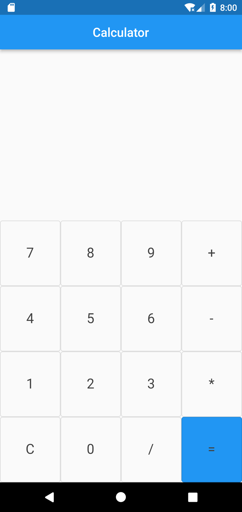
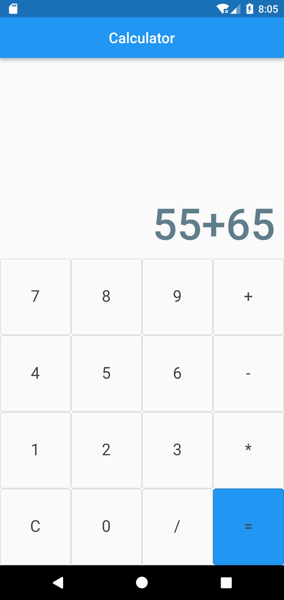
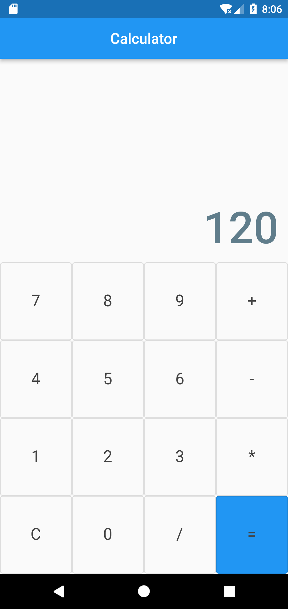
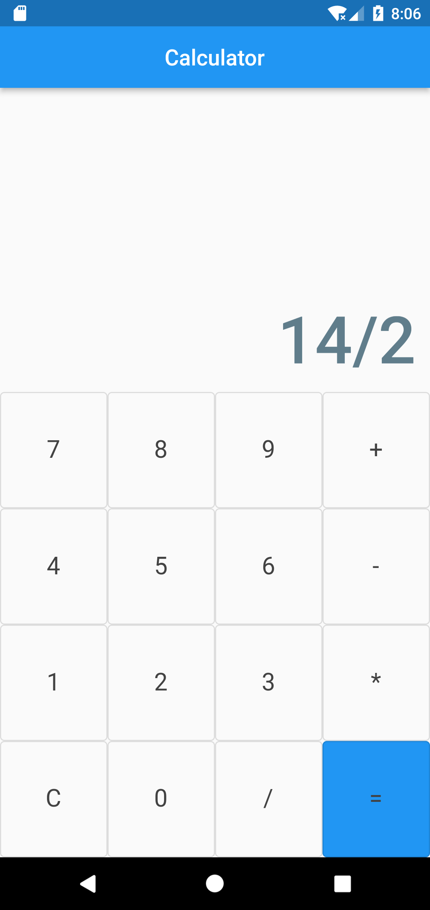
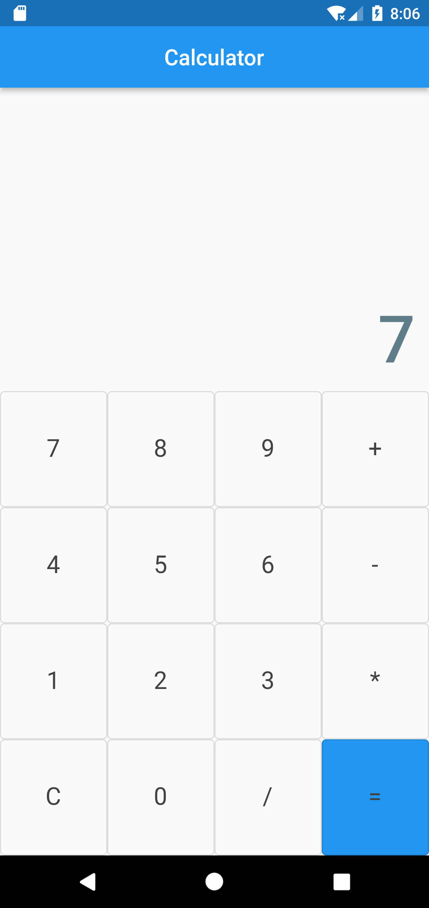

# calculator_app
 Simple arithmatic calculator designed in Flutter using Dart language with simple UI.
 
 A beginners project to get introduce to the flutter development environment.
 
 ## Snapshots
 &nbsp;  &nbsp;  &nbsp;  &nbsp; 

## Reference
For help getting started with Flutter, view [online documentation](https://flutter.dev/docs), which offers tutorials, samples, guidance on mobile development, and a full API reference.
